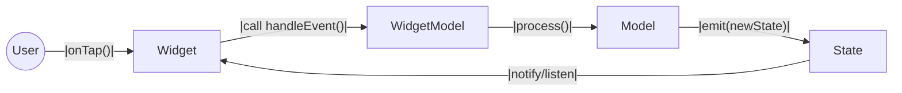

# Description
This document describes what a new feature should look like. The discussion is at the code level; it’s assumed you’re already familiar with how the project architecture works. Unless stated otherwise, the feature-first architecture is used; see [this document](feature_based_architecture.md).

## Introduction
Each feature should be virtually independent from others. If the new feature is a screen, the parameter for opening it should be the entity’s `[int id]` (user should easily use your feature).
If some objects need to be passed, they are allowed within a single feature, and that screen can only be opened from within this feature. Otherwise, design the screen so that the amount of data passed is minimal. This is important both for proper deep-link ↔ web parity and for being able to easily and quickly open the required screen from anywhere.
If you want to optimize load speed and avoid extra requests, it’s better to do so via request caching rather than by passing data around.

## Feature Structure
Roughly speaking, each feature has three layers:
1. Business logic layer [Model] — this is the `StateController`. Contains the logic and emits states. Has no Flutter imports and no ties to widgets at all — nor should it.
2. Widget-logic layer [WidgetModel] — this is the `ScopeController`. Contains simple logic related to widgets and/or `BuildContext`, with access to the top-level widget context of the feature.
3. UI layer [Widget] — what the user actually interacts with. Listens to `StateController` states via the Scope and interacts with the `StateController` through the `ScopeController`.

The interaction between UI and logic looks like this:

The user interacts with the UI. The UI may perform either some simple logic or more complex logic tied to business rules. If it’s complex, it’s sent to the `WidgetModel`. The `WidgetModel` may gather additional data or forward directly to the `Model`. The `Model` executes some logic and returns a `State` as the result. This `State` is stored in an `InheritedWidget`, so all widgets that obtain state via it automatically receive updated data.

### Implementation Examples
1. Using [InheritedNotifier](inherited_notifier_example.md) when little logic is needed.
2. Using [InheritedModel](inherited_model_example.md), when flexibility matters.

Usually, option 2 is preferred. All new features should also use the feature structure shown in these examples — i.e., there is an `InheritedModel`, a `StateController`, and the screen itself.
